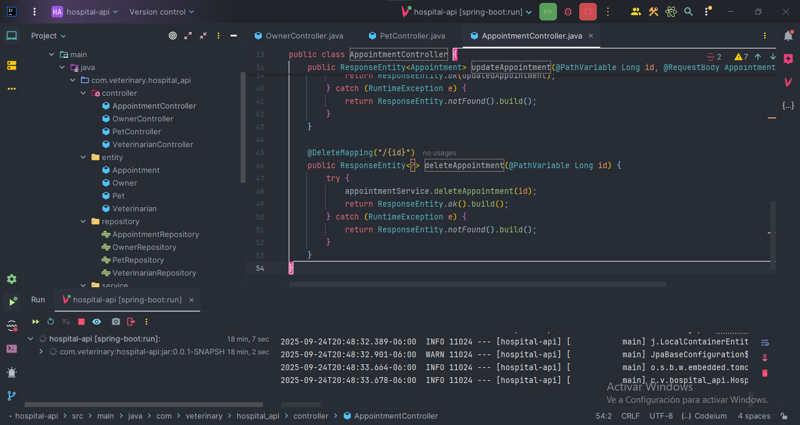
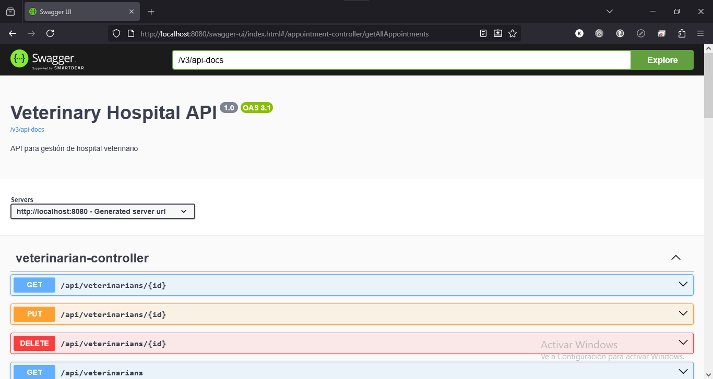

# 🏥 Veterinary Hospital API

API REST completa para gestión de hospital veterinario desarrollada con Spring Boot. Este proyecto demuestra habilidades en desarrollo backend Java con arquitectura RESTful.

## 🚀 Características

- **CRUD Completo** para dueños, mascotas, veterinarios y citas
- **Validaciones robustas** de datos de entrada
- **Documentación automática** con Swagger UI
- **Base de datos MySQL** con JPA/Hibernate
- **API RESTful** siguiendo mejores prácticas
- **Manejo de errores** profesional
- **Relaciones JPA** (@OneToMany, @ManyToOne)

## 🛠️ Stack Tecnológico

### Backend
- **Java 21** + Spring Boot 3.5.6
- **Spring Data JPA** - Persistencia ORM
- **Spring Validation** - Validaciones de datos
- **Spring Web** - API REST

### Base de Datos
- **MySQL 8.0** - Base de datos relacional
- **Hibernate** - Mapeo objeto-relacional

### Herramientas
- **Maven** - Gestión de dependencias
- **Swagger/OpenAPI** - Documentación API
- **Postman** - Pruebas de endpoints

## 📋 Modelo de Datos
Owners (Dueños) → Pets (Mascotas) → Appointments (Citas) ← Veterinarians (Veterinarios)

### Entidades Principales
- **Owner**: Dueños de mascotas (nombre, teléfono, email)
- **Pet**: Mascotas (nombre, especie, raza, edad, dueño)
- **Veterinarian**: Veterinarios (nombre, especialidad, licencia)
- **Appointment**: Citas (fecha, motivo, estado, mascota, veterinario)

## 🔧 Instalación y Configuración

### Prerrequisitos
- Java 21 o superior
- MySQL 8.0+
- Maven 3.6+

### Pasos de Instalación
1. **Clonar el repositorio**
git clone https://github.com/baitolotus/veterinary-hospital-api.git
cd hospital-api

2. **Configurar base de datos MySQL**
CREATE DATABASE veterinary_hospital;

3. **Configurar conexión en application.properties**
spring.datasource.url=jdbc:mysql://localhost:3306/veterinary_hospital
spring.datasource.username=tu_usuario
spring.datasource.password=tu_password

4. **Ejecutar la aplicación**
mvn spring-boot:run

5. **Acceder a la aplicación**
API: http://localhost:8080

# 📚 Endpoints de la API

## Dueños (`/api/owners`)

| Método | Endpoint | Descripción |
|--------|----------|-------------|
| GET | `/api/owners` | Listar todos los dueños |
| GET | `/api/owners/{id}` | Obtener dueño por ID |
| POST | `/api/owners` | Crear nuevo dueño |
| PUT | `/api/owners/{id}` | Actualizar dueño |
| DELETE | `/api/owners/{id}` | Eliminar dueño |

## Mascotas (`/api/pets`)

| Método | Endpoint | Descripción |
|--------|----------|-------------|
| GET | `/api/pets` | Listar todas las mascotas |
| GET | `/api/pets/{id}` | Obtener mascota por ID |
| POST | `/api/pets` | Crear nueva mascota |
| PUT | `/api/pets/{id}` | Actualizar mascota |
| DELETE | `/api/pets/{id}` | Eliminar mascota |

## Veterinarios (`/api/veterinarians`)

| Método | Endpoint | Descripción |
|--------|----------|-------------|
| GET | `/api/veterinarians` | Listar todos los veterinarios |
| GET | `/api/veterinarians/{id}` | Obtener veterinario por ID |
| POST | `/api/veterinarians` | Crear nuevo veterinario |
| PUT | `/api/veterinarians/{id}` | Actualizar veterinario |
| DELETE | `/api/veterinarians/{id}` | Eliminar veterinario |

## Citas (`/api/appointments`)

| Método | Endpoint | Descripción |
|--------|----------|-------------|
| GET | `/api/appointments` | Listar todas las citas |
| GET | `/api/appointments/{id}` | Obtener cita por ID |
| POST | `/api/appointments` | Crear nueva cita |
| PUT | `/api/appointments/{id}` | Actualizar cita |
| DELETE | `/api/appointments/{id}` | Eliminar cita |

# 🎯 Documentación Interactiva

La API incluye documentación automática con Swagger UI disponible en:
http://localhost:8080/swagger-ui.html
Desde Swagger puedes:

    Ver todos los endpoints disponibles

    Probar las operaciones directamente

    Ver modelos de datos y validaciones
    
# 💾 Ejemplos de Uso
Crear un dueño

POST /api/owners
Content-Type: application/json

{
  "name": "María García",
  "phone": "555-9876",
  "email": "maria.garcia@email.com"
}

### Obtener todos los dueños
GET /api/owners

### Actualizar un dueño
PUT /api/owners/1
Content-Type: application/json

{
  "name": "Juan Pérez Actualizado",
  "phone": "555-1111",
  "email": "juan.nuevo@email.com"
}

# 🏗️ Estructura del Proyecto
src/main/java/com/veterinary/hospital_api/
├── config/           # Configuraciones (Swagger)
├── controller/       # Controladores REST
├── entity/          # Entidades JPA
├── repository/      # Repositorios de datos
├── service/         # Lógica de negocio
└── HospitalApiApplication.java

# 📸 Capturas de Pantalla

### Pruebas de Postman

### Estructura de tablas y entidades

### Conexión a la base de datos y servidor

### Creación de la base de datos

### Creación de controller

### Arquitectura del proyecto

### Paquete de entidades

### Lógica de negocio

### Dependencias y configuración

### Pruebas Swagger

### Clase principal

### Configuración y ejecución

## 👨‍💻 Autor

**¡Hola! Soy Angel Castillo** 👋  
**Desarrollador Java Backend** apasionado por crear APIs robustas y escalables.

🚀 **Tecnologías que domino:**
- Java • Spring Boot • JPA/Hibernate
- MySQL • REST APIs • Maven
- Git • Postman • Swagger

📫 **¿Quieres conectar?**
- **LinkedIn:** [linkedin.com/in/tecangelcastillo](https://www.linkedin.com/in/tecangelcastillo)
- **Portfolio:** [En construcción 🚧](https://github.com/baitolotus/portfolio)
- **GitHub:** [github.com/baitolotus](https://github.com/baitolotus)

## 📄 Licencia

**MIT License** - Ver archivo [LICENSE](LICENSE) para detalles completos.

**Permisos:**
- ✅ Uso comercial
- ✅ Modificación
- ✅ Distribución
- ✅ Uso privado

**Solo requiere:** Incluir aviso de copyright y licencia en las copias.

⭐ **¡Si te gustó este proyecto, dale una estrella al repo!**